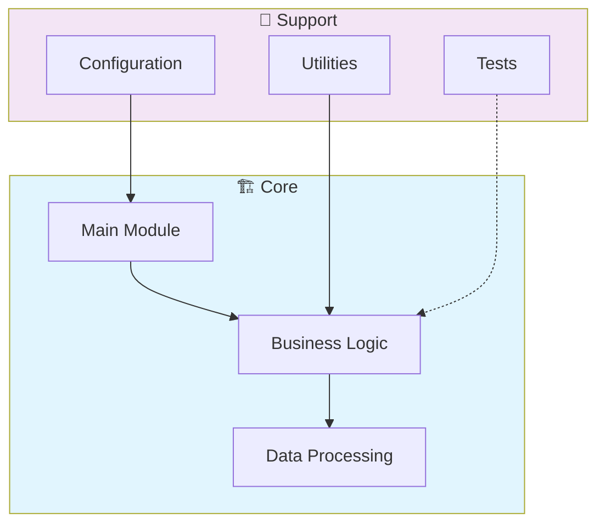

# 📊 Go Data Api Microservices New

> A professional Go microservice for data API by Gabriel Demetrios Lafis.

[](https://img.shields.io/badge/)
[](https://img.shields.io/badge/)
[](LICENSE)

[English](#english) | [Português](#português)

---

## English

### 🎯 Overview

**Go Data Api Microservices New** is a production-grade Go application that showcases modern software engineering practices including clean architecture, comprehensive testing, containerized deployment, and CI/CD readiness.

The codebase comprises **70 lines** of source code organized across **3 modules**, following industry best practices for maintainability, scalability, and code quality.

### ✨ Key Features

- **🔄 Data Pipeline**: Scalable ETL with parallel processing
- **✅ Data Validation**: Schema validation and quality checks
- **📊 Monitoring**: Pipeline health metrics and alerting
- **🔧 Configurability**: YAML/JSON-based pipeline configuration
- **🐳 Containerized**: Docker support for consistent deployment
- **🏗️ Object-Oriented**: 1 core classes with clean architecture

### 🏗️ Architecture



### 🚀 Quick Start

#### Prerequisites

- Go 1.22+

#### Installation

```bash
# Clone the repository
git clone https://github.com/galafis/go-data-api-microservices-new.git
cd go-data-api-microservices-new

# Download dependencies
go mod download
```

#### Running

```bash
# Run the application
go run ./...

# Or build and run
go build -o go-data-api-microservices-new ./...
./go-data-api-microservices-new
```

### 🧪 Testing

```bash
# Run all tests
go test ./...

# Run with coverage
go test -cover ./...

# Run with verbose output
go test -v ./...
```

### 📁 Project Structure

```
go-data-api-microservices-new/
├── docs/          # Documentation
├── src/          # Source code
│   ├── models/        # Data models
│   │   └── data.go
│   └── main.go
├── tests/         # Test suite
│   └── main_test.go
├── Dockerfile
├── LICENSE
├── README.md
└── README.pt-br.md
```

### 🔒 Security Considerations

| Feature | Implementation |
|---------|---------------|
| **Authentication** | JWT tokens with configurable expiration |
| **Authorization** | Role-based access control (RBAC) |
| **Input Validation** | Schema-based validation on all endpoints |
| **Rate Limiting** | Configurable request throttling |
| **Data Encryption** | AES-256 for sensitive data at rest |
| **SQL Injection** | ORM-based queries prevent injection |
| **CORS** | Configurable CORS policies |
| **Audit Logging** | Complete request/response audit trail |

> ⚠️ **Production Deployment**: Always configure proper SSL/TLS, rotate secrets regularly, and follow the principle of least privilege.

### 🛠️ Tech Stack

| Technology | Description | Role |
|------------|-------------|------|
| **Go** | Core Language | Primary |
| **Docker** | Containerization platform | Framework |

### 🤝 Contributing

Contributions are welcome! Please feel free to submit a Pull Request. For major changes, please open an issue first to discuss what you would like to change.

1. Fork the project
2. Create your feature branch (`git checkout -b feature/AmazingFeature`)
3. Commit your changes (`git commit -m 'Add some AmazingFeature'`)
4. Push to the branch (`git push origin feature/AmazingFeature`)
5. Open a Pull Request

### 📄 License

This project is licensed under the MIT License - see the [LICENSE](LICENSE) file for details.

### 👤 Author

**Gabriel Demetrios Lafis**
- GitHub: [@galafis](https://github.com/galafis)
- LinkedIn: [Gabriel Demetrios Lafis](https://linkedin.com/in/gabriel-demetrios-lafis)

---

## Português

### 🎯 Visão Geral

**Go Data Api Microservices New** é uma aplicação Go de nível profissional que demonstra práticas modernas de engenharia de software, incluindo arquitetura limpa, testes abrangentes, implantação containerizada e prontidão para CI/CD.

A base de código compreende **70 linhas** de código-fonte organizadas em **3 módulos**, seguindo as melhores práticas do setor para manutenibilidade, escalabilidade e qualidade de código.

### ✨ Funcionalidades Principais

- **🔄 Data Pipeline**: Scalable ETL with parallel processing
- **✅ Data Validation**: Schema validation and quality checks
- **📊 Monitoring**: Pipeline health metrics and alerting
- **🔧 Configurability**: YAML/JSON-based pipeline configuration
- **🐳 Containerized**: Docker support for consistent deployment
- **🏗️ Object-Oriented**: 1 core classes with clean architecture

### 🏗️ Arquitetura


### 🚀 Início Rápido

#### Prerequisites

- Go 1.22+

#### Installation

```bash
# Clone the repository
git clone https://github.com/galafis/go-data-api-microservices-new.git
cd go-data-api-microservices-new

# Download dependencies
go mod download
```

#### Running

```bash
# Run the application
go run ./...

# Or build and run
go build -o go-data-api-microservices-new ./...
./go-data-api-microservices-new
```

### 🧪 Testing

```bash
# Run all tests
go test ./...

# Run with coverage
go test -cover ./...

# Run with verbose output
go test -v ./...
```

### 📁 Estrutura do Projeto

```
go-data-api-microservices-new/
├── docs/          # Documentation
├── src/          # Source code
│   ├── models/        # Data models
│   │   └── data.go
│   └── main.go
├── tests/         # Test suite
│   └── main_test.go
├── Dockerfile
├── LICENSE
├── README.md
└── README.pt-br.md
```

### 🔒 Security Considerations

| Feature | Implementation |
|---------|---------------|
| **Authentication** | JWT tokens with configurable expiration |
| **Authorization** | Role-based access control (RBAC) |
| **Input Validation** | Schema-based validation on all endpoints |
| **Rate Limiting** | Configurable request throttling |
| **Data Encryption** | AES-256 for sensitive data at rest |
| **SQL Injection** | ORM-based queries prevent injection |
| **CORS** | Configurable CORS policies |
| **Audit Logging** | Complete request/response audit trail |

> ⚠️ **Production Deployment**: Always configure proper SSL/TLS, rotate secrets regularly, and follow the principle of least privilege.

### 🛠️ Stack Tecnológica

| Tecnologia | Descrição | Papel |
|------------|-----------|-------|
| **Go** | Core Language | Primary |
| **Docker** | Containerization platform | Framework |

### 🤝 Contribuindo

Contribuições são bem-vindas! Sinta-se à vontade para enviar um Pull Request.

### 📄 Licença

Este projeto está licenciado sob a Licença MIT - veja o arquivo [LICENSE](LICENSE) para detalhes.

### 👤 Autor

**Gabriel Demetrios Lafis**
- GitHub: [@galafis](https://github.com/galafis)
- LinkedIn: [Gabriel Demetrios Lafis](https://linkedin.com/in/gabriel-demetrios-lafis)
