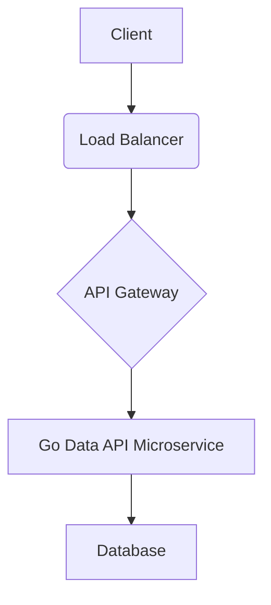

# Go Data API Microservice

[Português](README.pt-br.md) | [English](README.md)


<p align="center">
  
</p>

## Overview

This repository contains a simple Go microservice that exposes a data API. It demonstrates a professional project structure, functional code with unit tests, and comprehensive bilingual documentation.

## Features

- **Professional Structure**: Organized with `src/`, `tests/`, `docs/`, and `config/` folders.
- **Functional Code**: A basic Go HTTP server with a data endpoint.
- **Unit Tests**: Comprehensive unit tests for API handlers.
- **Bilingual Documentation**: `README.md` in English and Portuguese.
- **Visual Elements**: Architecture diagrams and badges.

## Architecture

The microservice architecture is designed for scalability and maintainability.



## Getting Started

### Prerequisites

- Go (version 1.18 or higher)

### Installation

1. Clone the repository:
   ```bash
   git clone https://github.com/galafis/go-data-api-microservices-new.git
   cd go-data-api-microservices
   ```
2. Compile the application:
   ```bash
   go build -o bin/server src/main.go
   ```

### Running the Application

```bash
./bin/server
```

The server will start on `http://localhost:8080`.

### API Endpoints

- `GET /`: Returns a welcome message.
- `GET /data`: Returns a JSON array of sample data.

Example usage with `curl`:

```bash
curl http://localhost:8080/
# Expected output: Welcome to the Go Microservices API!

curl http://localhost:8080/data
# Expected output: [
#   {
#     "id": "1",
#     "name": "Item 1"
#   },
#   {
#     "id": "2",
#     "name": "Item 2"
#   }
# ]
```

## Running Tests

To run the unit tests, execute the following command:

```bash
go test ./tests
```

## Contributions

Contributions are welcome! Feel free to open issues or submit pull requests.

## License

This project is licensed under the MIT License - see the [LICENSE](LICENSE) file for details.

## Author

**Gabriel Demetrios Lafis**

