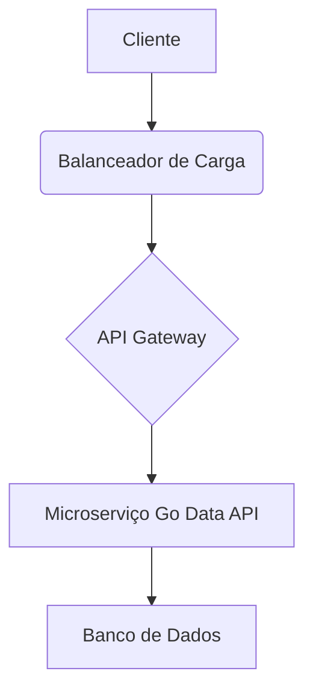

# Microserviço Go Data API

[Português](README.pt-br.md) | [English](README.md)


<p align="center">
  
</p>

## Visão Geral

Este repositório contém um microserviço Go simples que expõe uma API de dados. Ele demonstra uma estrutura de projeto profissional, código funcional com testes unitários e documentação bilíngue abrangente.

## Funcionalidades

- **Estrutura Profissional**: Organizado com as pastas `src/`, `tests/`, `docs/` e `config/`.
- **Código Funcional**: Um servidor HTTP Go básico com um endpoint de dados.
- **Testes Unitários**: Testes unitários abrangentes para os manipuladores da API.
- **Documentação Bilíngue**: `README.md` em inglês e português.
- **Elementos Visuais**: Diagramas de arquitetura e badges.

## Arquitetura

A arquitetura do microserviço é projetada para escalabilidade e manutenibilidade.



## Primeiros Passos

### Pré-requisitos

- Go (versão 1.18 ou superior)

### Instalação

1. Clone o repositório:
   ```bash
   git clone https://github.com/galafis/go-data-api-microservices-new.git
   cd go-data-api-microservices
   ```
2. Compile a aplicação:
   ```bash
   go build -o bin/server src/main.go
   ```

### Executando a Aplicação

```bash
./bin/server
```

O servidor será iniciado em `http://localhost:8080`.

### Endpoints da API

- `GET /`: Retorna uma mensagem de boas-vindas.
- `GET /data`: Retorna um array JSON de dados de exemplo.

Exemplo de uso com `curl`:

```bash
curl http://localhost:8080/
# Saída esperada: Welcome to the Go Microservices API!

curl http://localhost:8080/data
# Saída esperada: [
#   {
#     "id": "1",
#     "name": "Item 1"
#   },
#   {
#     "id": "2",
#     "name": "Item 2"
#   }
# ]
```

## Executando Testes

Para executar os testes unitários, execute o seguinte comando:

```bash
go test ./tests
```

## Contribuições

Contribuições são bem-vindas! Sinta-se à vontade para abrir issues ou enviar pull requests.

## Licença

Este projeto está licenciado sob a Licença MIT - veja o arquivo [LICENSE](LICENSE) para detalhes.

## Autor

**Gabriel Demetrios Lafis**


